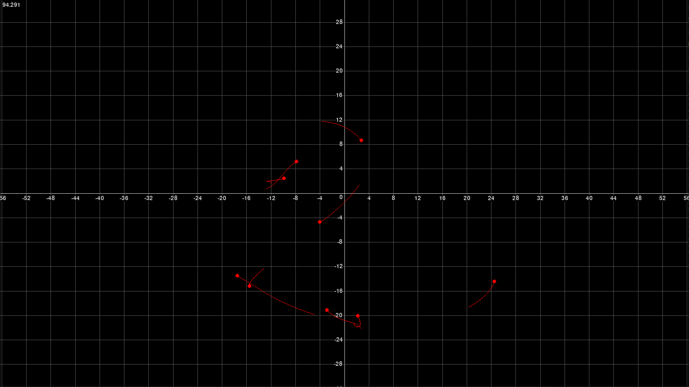

# Gravity simulation

This project is a numerical gravity simulation using Newtons laws of gravitation to approximate the chaotic motion of many bodies

# How to use

*The pygame module is required

- Run the main script
- Use wasd to move around
- Change the scene variable in the main script to change the initial conditions
- The script as is starts with 10 randomly placed bodies with a net momentum of 0

# Gallery

